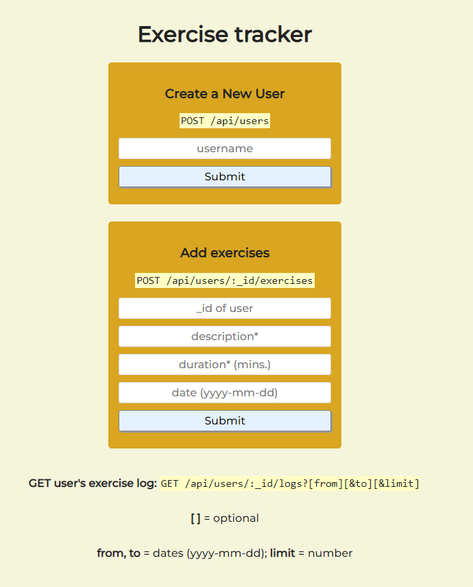

<h1 align="center">BackEndDevelopmentandAPIsProjects_fCC</h1>
<h2 align="center">Exercise Tracker:</h2>

  <a href="https://exercise-tracker-service.onrender.com/">exercise-tracker-service</a>

  

<h2 align="center">File Metadata Microservice:</h2>

  <a href="https://filemetadate-service.onrender.com/">filemetadate-service</a>

 

  

 

